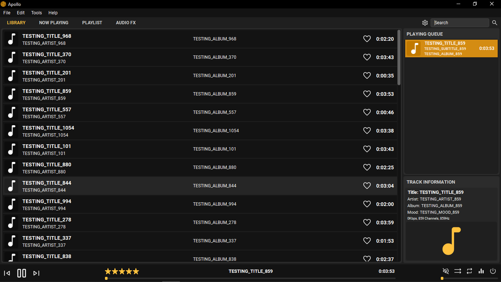

[](https://www.python.org/)

[](https://GitHub.com/Naereen/StrapDown.js/graphs/commit-activity)
[](https://pypi.python.org/pypi/ansicolortags/)
[](http://perso.crans.org/besson/LICENSE.html)
[](https://github.com/Naereen/badges/)


# Apollo


#### Apollo is a Open-Source music player for playback and organization of audio files on Microsoft   Windows, built using Python.

- Audio playback: MP3, AAC, M4A, MPC, OGG, FLAC, ALAC, APE, Opus, TAK, WavPack, WMA, WAV, MIDI, MOD, UMX, XM.
- File converter: single/batch file conversion from/to all supported audio formats, with original metadata preserved. In dealing with identical output files instances, provided that re-encoding is unnecessary, the process has optional instructions for selective skipping in favor of performing a tag-only synchronization.
- Gapless playback: eliminates the timing related artifacts in transitions between consecutive audio tracks to provide a relatively uninterrupted listening experience.
- ReplayGain: performs normalization of volume levels among individual tracks, equalizing their perceived loudness to achieve a more seamless playlist progression.
- Library management: find, organize and rename music into particular folders and files based on any combination of audio tag values such as artist, album, track number, or other metadata. Apollo can be configured to monitor and perform this task automatically for select libraries, while at the same time allowing users to take manual control on a case-by-case basis.
- Look and feel customization: the layout and appearance of various player elements is open for extensive modification, including adjustable key bindings.
- MiniLyrics integration: for display and editing of song lyrics synchronized to audio files.
- Apollo supports the DirectSound, ASIO and WASAPI audio interfaces, and it uses 32-bit audio processing
- Auto DJ: a user-programmable playlist generator, expanding beyond capabilities of the default shuffle presets and settings.
- Sleep & Shutdown modes, for scheduled exit with gradual volume fade out function.
- Web scraping: integrates Fanart.tv, and similar providers, to retrieve high-quality pictures of artists and album covers for music in library

# Executing From Source
Apollo can be executed directly after an virtual environment has been set up using poetry.

### Cloning the repository locally
```shell
$ git clone https://github.com/OmmarShaikh01/Apollo.git Apollo
```
Once that command completes successfully, you should see a new Apollo folder in your current directory.

### Setting up poetry on the global interpreter
```shell
$ pip install --user poetry
```
Once that command completes successfully, update poetry to the latest stable version available
```shell 
$ poetry self update
```

### Creating venv using poetry
```shell
$ cd Apollo
$ poetry shell
```
Activates the local venv shell using the local .venv file

### Installing Production Dependencies
```shell
$ poetry install --no-dev
```

### Setup Local Environment for Development
```shell
$ poetry install 
```

### Executing Apollo
If venv not already activated,
```shell
$ cd Apollo
$ poetry shell
```
Execute Module
```shell
$ python.exe -m apollo
```


License
----
- [GPL v3]

[](https://GitHub.com/Naereen/)


[pyo]: <http://ajaxsoundstudio.com/software/pyo/>
[PySide6]: <https://www.qt.io/>
[mutagen]: <https://mutagen.readthedocs.io/en/latest/>
[Python3.8]: <https://www.python.org/>
[GPL v3]: <https://github.com/UGLYclown999/Apollo/blob/master/LICENSE>
